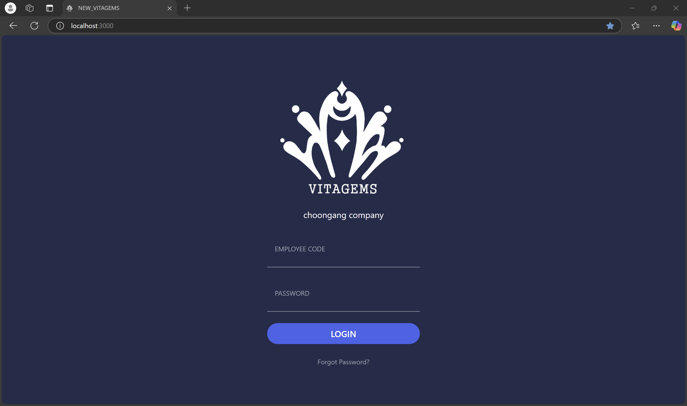
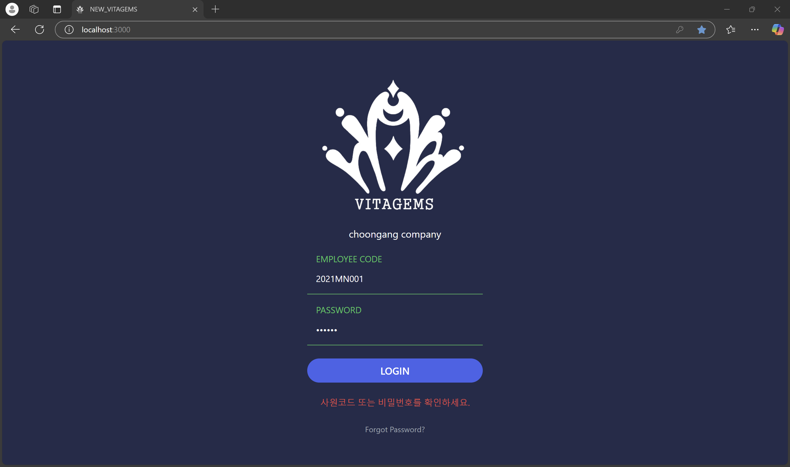
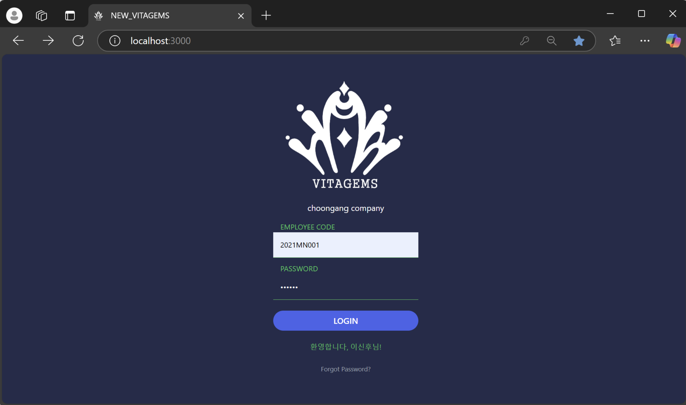
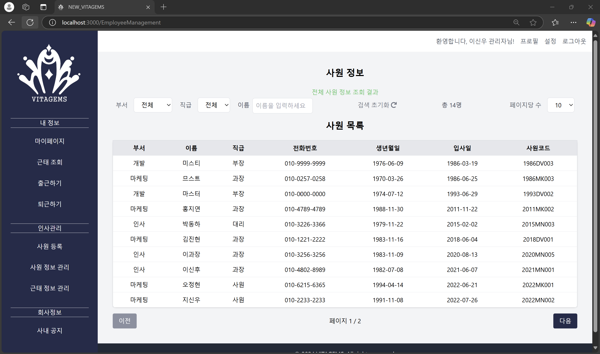

---

# 

---

# 📊 프로젝트 진행 상황

**프로젝트 시작일**: 2024년 10월 15일  
**현재 상태**: 진행 중 🛠️  

---

## 📋 프로젝트 개요
**newVitagems**는 사원, 관리자, 마스터 사용자가 각자의 역할에 맞게 인사 관리, 출퇴근 내역 조회 및 관리, 사내 공지 확인 등의 기능을 수행할 수 있는 **웹 기반 인사 관리 시스템**입니다.  

- **Spring Security**와 **JWT**를 통해 다양한 권한 및 인증 절차를 구현합니다.
- 사용자의 정보를 안전하게 보호하고 효율적인 관리를 제공합니다.

---

## 🎯 프로젝트 목적
1. **보안 학습**: Spring Security와 JWT 토큰을 활용한 인증 시스템 학습  
2. **연동 학습**: React와 Spring Boot 간의 통신  
3. **권한 관리**: 사원, 관리자, 마스터 권한별로 UI와 기능 차별화  
4. **데이터 관리 기능 강화**: 필터 및 검색 기능을 통한 효율적인 출퇴근 관리  

---

## 🚀 주요 기능
### 🌟 사원 기능
- **개인정보 수정**
- **출퇴근 내역 조회 및 보고**
- **사내 공지 확인**
- **위치 기반 출퇴근 기록 관리** (1km 이내에서만 가능)
- **이메일 인증 시스템** ✔️ (11/09)

### 🌟 관리자 기능
- **사원 정보 조회 및 수정** ✔️
- **출퇴근 내역 관리 및 수정**
- **사원 등록 및 중복 체크** ✔️ (전화번호로 중복 여부 확인인)
- **사원 상세 정보 수정** ✔️  

### 🌟 마스터 기능
- **회사 정보 설정** ✔️ 위치 및 출퇴근 지정 시간간 관리  
- **출퇴근 규칙 설정**  
- **관리자 권한 포함 총괄 관리**  

---

## 🖥️ 구현 화면

### 🔑 홈 화면
| 홈 | 로그인 실패 | 로그인 성공 (관리자) |
|---|---|---|
|  |  |  |

---

### 🏠 메인 화면
| 마스터 메인 화면 | 관리자 메인 화면 | 사원 메인 화면 |
|---|---|---|
| .png) | .png) | .png) |

---

### 🧑‍💼 마이페이지
| 마이페이지 (모든 권한 공통) |
|---|
| .png) |

---

### 📋 사원 관리
| 사원 관리 화면 (관리자 & 마스터) |
|---|
|  |

---

## 🛠️ 기술 스택
- **Frontend**: React, Tailwind CSS, JavaScript, JSON
- **Backend**: Spring Boot (Java), Spring Security, JWT  
- **Database**: MySQL  

---

## 🔐 보안 및 인증
- **Spring Security**: 비밀번호 암호화 및 인증 처리 ✔️  
- **JWT 기반 인증**: 액세스 및 리프레시 토큰 관리 ✔️  
- **이메일 인증 및 비밀번호 재설정** ✔️  

---

## 📅 향후 계획
1. JWT 기능 개선 (리프레시 토큰 활용)  
2. 출퇴근 기록 관리 기능 확장  
3. 근태 관리 기능 추가  
4. 퇴사자 관리 및 삭제 기능  

---

## 🌐 설치 및 실행

### 1. 리포지토리 클론
```bash
git clone https://github.com/dmsp0/newVitagems.git
```

### 2. 백엔드 실행
```bash
./gradlew bootRun
```

### 3. 프론트엔드 실행
```bash
npm start
```

---